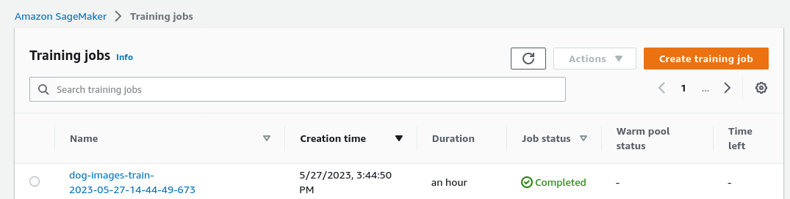
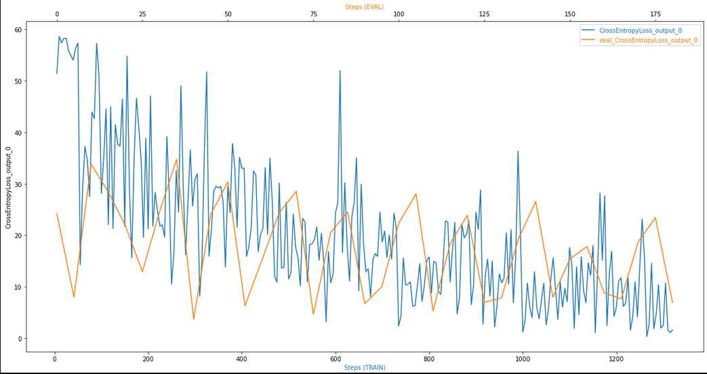

## Project 3: Image Classification using AWS SageMaker

AWS Sagemaker was used to use transfer learning to train a pretrained model (Resnet34) 
to predict which dog breed a dog image is. The input data consisted of 133 classes of dog images.
Aside from hyper-parameter tuning Sagemaker profiler and debugger were used during the training process.
Training and evaluation losses were plotted and some recommendations on model improvements provided.
The model was deployed at an endpoint with a couple of inference examples carried out for testing. Process:

- A pre-trained Resnet34 model was adapted for dog image classification by adding additional dense layers.
- Hyperparameters were tuned to find the best hyperparameter combination.
- The model was trained, where Sagemaker debugger and profiler were used with their outputs recorded.
- The model was deployed to an endpoint and a number of inferences were carried out on test images.

## Kernel, Python versions and main code files
Kernel:  PyTorch 1.13.0 with Python 3.9 on ml.t3.medium

-  : the main notebook from which tuning, training and endpoint deployment is triggered
-  : script that contains functions for hyperparameter tuning
-  : script that contains functions for model training
-  : script that contains code used as entry point for deployed model endpoint 

## Dataset
The input dataset used for the dog image classification is the dataset suggested by the project (number of classes - 133):

https://s3-us-west-1.amazonaws.com/udacity-aind/dog-project/dogImages.zip

### Access
Upload the data to an S3 bucket through the AWS Gateway so that SageMaker has access to the data:
Data was uploaded to S3 bucket: s3://sagemaker-us-east-1-308298057408/data/dogImages

## Hyperparameter Tuning and Training
What kind of model did you choose for this experiment and why? Give an overview of the types of parameters and their ranges 
used for the hyperparameter search:
A multi-class image classification model was used to classify dog images with 133 classes.
As a model a CNN (Resnet34) was used with added linear layers for transfer learning.

For loss optimisation the Adam Optimiser was used and CrossEntropyLoss as a loss function.
Other optimisers, such as AdamW, RMSprop and SGD as well as ADAgrad and ADADelta were also tested but Adam and AdamW
performed better overall with limited computing resources in particular.
More fully connected NN layers were also added initially and Resnet50 trialled but this lead to more memory challenges 
and only one basic layer was added to the pre-trained Resnet34 in the end.

Tuned hyperparameters for final model based Adam Optimiser were:
- epochs: 10
- eps: 0.000001
- learning rate (lr) - range: (0.001 - 0.2)
- batch_size - values: [64, 128, 256, 264]

**Best hyperparameters were:** epochs = 10, eps = 0.000001, batch_size = 128, lr = .026764018583884622

Links to screenshots for hyperparameter tuning,  training jobs, and also outputs to S3 bucket:

Losses for training and validation data are plotted in the graph, showing a gradual decline for both training 
and validation data initially but it also points to some over-fitting on training data as validation loss becomes
stagnant. Smaller learning rates can usually help with this issue (the relatively large learning rate used was a result of 
hyperparameter tuning but there may be better global optima and the returned hyperparameters may only be a local optimum).

## Model Performance
- With limited compute instance types available a respectable model accuracy was reached after 25 epochs of training:
just over 50% on training data but still a bit below 40% on validation and test data, evidence of some over-fitting. 
- Best hyperparameters returned may be a local optimum and tweaking the ranges, especially with a lower learning rate
upper bound, is expected to further improve model accuracy and remedy some over-fitting issues on the training data.

## Debugging and Profiling with Results
Sagemaker provides model debugging functionality where one can set rules, and the debugger also logs issues and results. 
The rules for over-fitting, over-training, vanishing gradient, poor weight initialisation, and loss not decreasing were
added. Logging statements were also added to functions so that the output can be inspected in CloudWatch logs of the
respective hyperparameter tuning or training jobs. This is an important toolset for tracking down issues.

Initially, vanishing gradient issues occurred, and adding a higher 'eps' value than the default value helped with that.
Some remaining issues with poor weight initialisation point to too little processing capacity, and this has caused the 
neural network to learn less well with poorer accuracy especially on the validation and test datasets.
Choosing more powerful instance types, such as 'ml.g4dn.2xlarge' or higher, or GPU compute units is expected to remedy
this but current account profile restrictions mean that it as not possible to do this.

Sagemaker Profiler can be used to flag compute performance, which shows system usage statistics, such as low or high CPU, GPU 
utilisation. The Profiler Report also flags how many times profiler rule infringements were triggered. Four types were
triggered, with by far the most frequent one being to do with memory issues:
- GPUMemoryIncrease: "Choose a larger instance type with more memory if footprint is close to maximum available memory.":
triggered 449 out of 5256 times.

Also triggered 36 times each were LowGPUUtilization and CPUBottlenecks, and BatchSize was also triggered 4 times.

Main step to take: use of larger compute instance types (limited by current account settings).

Link to SageMaker Profiler Report with further details: 

## Model Deployment
The model was deployed on a ml.m5.large instance. As an entry point the script 'inference.py' was used.

A screenshot shows the deployed endpoint:

The endpoint can be queried by submitting test images as input. It then returns the predicted results. The two images
supplied were one of Class 23 - a Bernese Mountain Dog, and one of Class 81 - a Greyhound.

test_img1 = plt.imread('./dogImages/test/023.Bernese_mountain_dog/Bernese_mountain_dog_01657.jpg')

test_img2 = plt.imread('./dogImages/test/081.Greyhound/Greyhound_05530.jpg')

Predicted classes returned from deployed endpoint were correct for test_img2: test_img1 - Class 80, test_img2 - Class 81.

This shows that code deployment works but it also reflects the fact that model accuracy, which only reached 50% on training data 
and with around 40% on validation and test data, is not very high yet and the deployed model thus more prone to wrong predictions.

Note: when code has completed it is important to delete deployed endpoints and to shut down instances no longer used.

